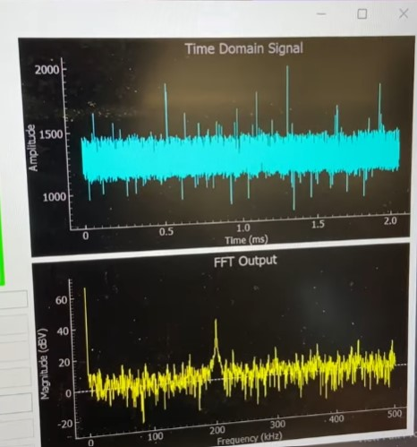
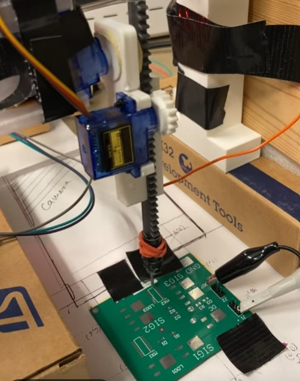
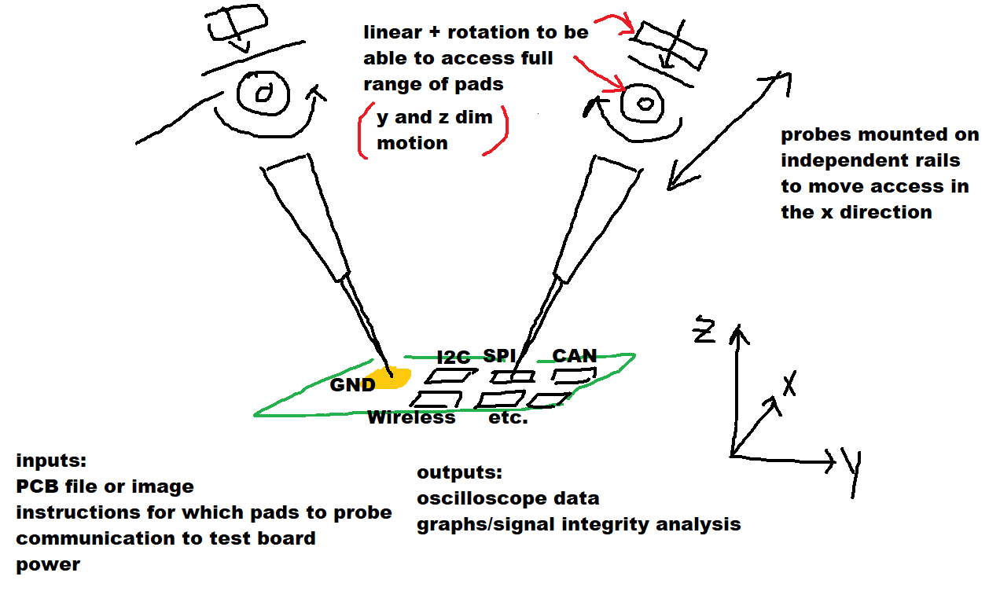

# Automated PCB Tester

### University of Toronto — ECE342 Embedded Systems
**Ryan Qi & Avani Yadav**

During my visit to a Shanghai Technology Fair in 2023, I was inspired by the incredible speed of the automated electronics testing machines.

We built an **automated PCB tester prototype** inspired by production **ICT and flying probe systems**.
- [Inspiration](https://www.youtube.com/watch?v=A3oJ12aXAco)

Completed in approximately **80 hours** for the ECE342 final project.

## Hardware

- **STM32F446ZE** [Product Info](https://www.st.com/en/microcontrollers-microprocessors/stm32f446ze.html)
- **OV7670 camera** [Camera Driver](./Automated_Circuit_Tester_Final/Core/Src/ov7670.c)
- **NEMA 17 stepper motor** [Nema17 Datasheet](https://transmotec.com/Download/Datasheets/Transmotec-Datasheet-SHW42-18.pdf)
- **SG90 servos** [SG90 Info](https://smarthon-docs-en.readthedocs.io/en/latest/Sensors_and_actuators/Servo.html)
- **PCA9685 servo driver** [View Servo Driver](./Automated_Circuit_Tester_Final/Core/Src/servomotors.c)
- **L298N stepper driver** [View Nema17 Driver](./Automated_Circuit_Tester_Final/Core/Src/steppermotors.c)

## Software

- **Embedded firmware:** C
- [Function Pointer FSM](./Automated_Circuit_Tester_Final/Core/Src/fsm.c)
- [Analog to Digital Conversion and Fast Fourier Transform](./Automated_Circuit_Tester_Final/Core/Src/adc_fft.c)
- [Motor Position Tracking](./Automated_Circuit_Tester_Final/Core/Src/motorposition.c)
- **PC interface:** Python [Source Code](./FinalGUI)
- **Communication:** UART, I2C

## Demo

**Click the images below to watch the demos.**

  

  

## Design & Prototype

| Probe Holder | System Display | Flying Probe |
|:---:|:---:|:---:|
|  |  |  |
